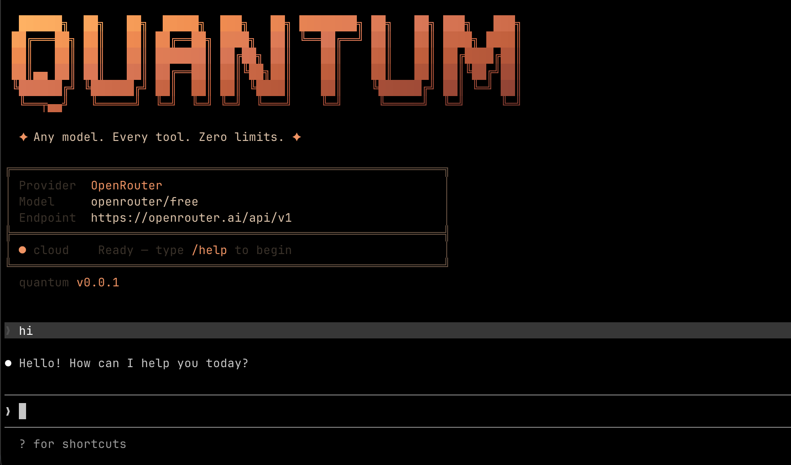

# Quantum CLI

### Terminal-First AI Coding Agent
**Developed by Suryanshu Nabheet**

---

Quantum CLI is a professional-grade, high-performance terminal agent designed for software engineering tasks. It provides a lightning-fast interface to leverage state-of-the-art Large Language Models (LLMs) for complex debugging, feature implementation, and architectural refactoring directly from your command line.



## Key Capabilities

- **Autonomous Engineering**: Executes multi-turn engineering workflows to inspect, debug, and implement software tasks.
- **Extensive Model Support**: Integrated support for Anthropic Claude, OpenAI GPT, Google Gemini, DeepSeek, xAI, and local providers via Ollama.
- **Professional Toolset**: Built-in tools for file manipulation, shell execution, diff patching, and system diagnostics.
- **MCP Compatibility**: Full implementation of the Model Context Protocol (MCP) for extensible tool and resource integration.
- **Privacy & Security**: Zero-telemetry architecture ensuring all project files, state, and credentials stay local.
- **High Performance**: Powered by Bun for minimal execution latency and instant startup.

---

## Installation

### Prerequisites
- [Bun](https://bun.sh) (v1.3+)
- [Node.js](https://nodejs.org) (v22+)

### Setup Process

```bash
# Install dependencies
bun install

# Build the binary
bun run build
```

## Usage

Configure your preferred API key and launch the agent:

```bash
# Using Anthropic Claude
export ANTHROPIC_API_KEY="your_key_here"
./bin/quantum

# Using OpenAI
export OPENAI_API_KEY="your_key_here"
./bin/quantum --provider openai

# Using Google Gemini
export GEMINI_API_KEY="your_key_here"
./bin/quantum --provider gemini

# Using Local Ollama
./bin/quantum --provider ollama --model llama3.2
```

---

## License

MIT License. Copyright (c) 2026 Suryanshu Nabheet. See [LICENSE](./LICENSE) for details.
