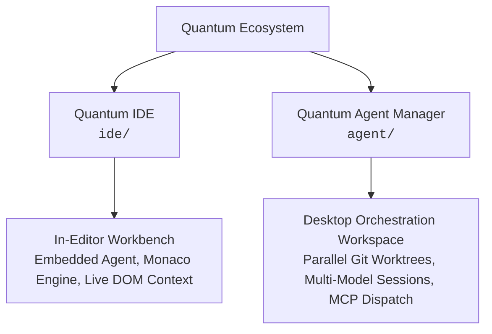

# Quantum Architecture & Ecosystem Documentation

This document specifies the overarching design, component relationships, and integration protocols governing the **Quantum** software ecosystem.

---

## Architectural Topology

Quantum partitions developer workflows across two specialized runtimes:



---

## Subsystem Specifications

### 1. Quantum IDE (`ide/`)
*Primary In-Editor Development Workbench*
- **Scope**: Serves as the primary editing and interactive development interface.
- **Implementation**: Built upon an extended Visual Studio Code foundation with custom workbench contributions (`src/vs/workbench/contrib/agent`).
- **Capabilities**:
  - Embedded AI assistant pane with workspace symbol indexing and semantic code context.
  - Native browser view with element-level DOM inspectability for visual debugging.
  - Multi-provider model configuration with customizable role assignments (chat, inline edit, autocomplete).
  - Open VSX extension compatibility with telemetry subsystems disabled.

---

### 2. Quantum Agent Manager (`agent/`)
*Autonomous Workspace and Multi-Agent Orchestrator*
- **Scope**: Dedicated desktop application for background tasks, long-running agent workflows, and parallel branch implementations.
- **Implementation**: Electron shell hosting a Vite/React interface coupled with an Effect-TS backend and WebSocket transport.
- **Capabilities**:
  - **Git Worktree Isolation**: Spawns isolated physical checkouts for concurrent task execution without workspace collision.
  - **Multi-Provider Dispatch**: Interfaces directly with Claude, GPT, Gemini, DeepSeek, Grok, and local providers.
  - **Agent State Handoff**: Transfers structured task context and message history across heterogeneous model engines.
  - **Integrated Telemetry View**: Inspects raw diff streams, terminal standard streams, and browser execution sessions in real time.

---

## Core System Invariants

1. **Client-Side Data Isolation**: All database state, indexed files, tokens, and model sessions reside exclusively within the host filesystem. Network communication is limited strictly to user-configured LLM API endpoints and MCP servers.
2. **Model Context Protocol (MCP) Standard**: All dynamic tools, prompt templates, and system integrations adhere to standard MCP client-server schemas.
3. **Decoupled Packaging**: Subsystems compile and package independently, preventing cross-dependency pollution between native C++ toolchains, Electron runtimes, and web bundlers.

---

## Repository Structure

```
quantum/
├── agent/       # Quantum Agent Manager desktop app and orchestration server
├── build/       # Quantum release build (VS Code upstream → branded binary)
├── docs/        # Documentation (Docusaurus)
├── extensions/  # Quantum built-in extensions (for release build)
├── ide/         # Quantum IDE editor core and workbench extensions
├── scripts/     # Monorepo setup (./scripts/setup.sh) and verification
├── LICENCE      # MIT License
├── CONTRIBUTING.md # Contribution policies
└── SECURITY.md  # Security vulnerability reporting standards
```
