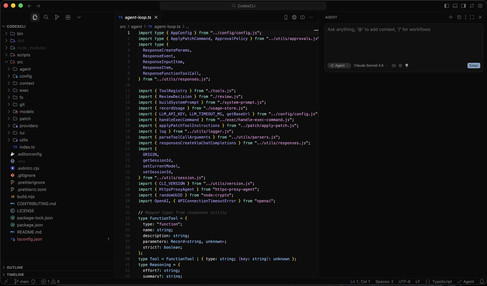
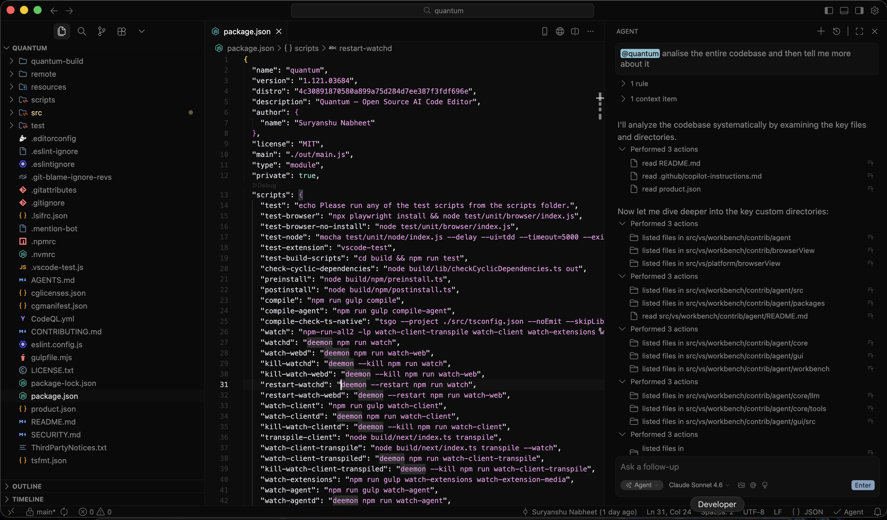
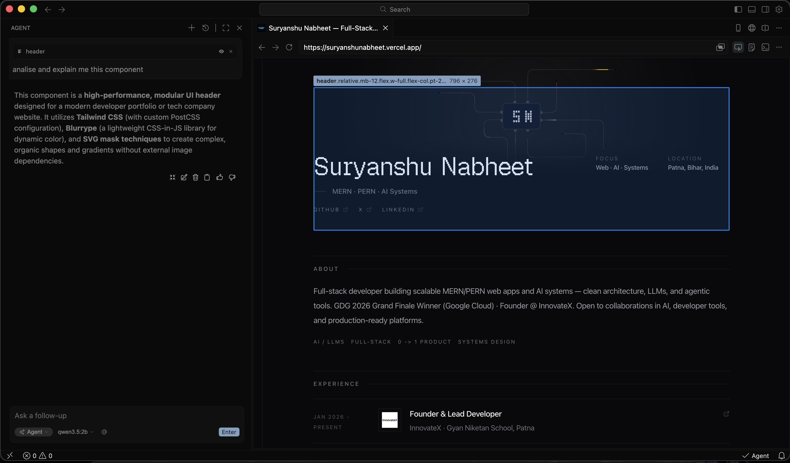
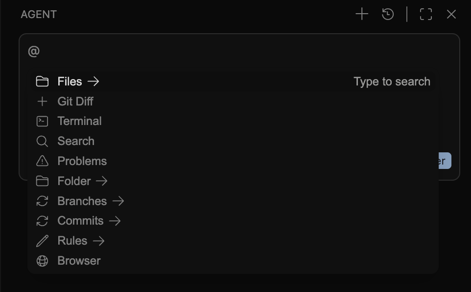

<p align="center">
  
</p>

# Quantum

[](https://github.com/Suryanshu-Nabheet/Quantum/issues?q=is%3Aopen+is%3Aissue+label%3Afeature-request+sort%3Areactions-%2B1-desc)
[](https://github.com/Suryanshu-Nabheet/Quantum/issues?q=is%3Aissue+is%3Aopen+label%3Abug)
[](https://github.com/Suryanshu-Nabheet/Quantum/blob/main/LICENSE.txt)
[](https://github.com/Suryanshu-Nabheet/Quantum)

[](https://github.com/Suryanshu-Nabheet/Quantum/releases/latest)

**Quantum** is an MIT-licensed, AI-native code editor — a fork of [Visual Studio Code](https://github.com/microsoft/vscode) with a **first-party agent** built into the workbench, plus an embedded browser that can attach live page context to chat.


Not a plugin bolted on later: the agent lives in [`src/vs/workbench/contrib/agent`](src/vs/workbench/contrib/agent) and ships as part of the IDE.

<p align="center">
  
</p>

## Product shots

### Agent working in the codebase

Ask the Agent to inspect, explain, and modify your project with the active workspace and relevant files in context.

<p align="center">
  
</p>

### Agent working through the browser

Use the integrated browser and element picker to give the Agent direct page context for debugging and implementation.

<p align="center">
  
</p>

### Rich `@` context menu

Attach the context your task needs, including code, files, images, videos, PDFs, Git changes, terminal output, browser content, and more.

<p align="center">
  
</p>

## What’s inside

### Full IDE (VS Code heritage)

- Complete workbench: editing, terminals, debugging, Git, search, extensions
- Familiar keybindings and layout, Quantum-branded
- Extensions via [Open VSX](https://open-vsx.org) (no proprietary marketplace lock-in)
- Microsoft telemetry removed at source; user data under `~/.quantum`

### Built-in Agent (`contrib/agent`)

- **Agent sidebar** — chat next to your code (`@` context, `/` slash prompts)
- **Multi-provider models** — Anthropic, OpenAI, Gemini, Azure, Bedrock, Ollama, OpenRouter, Groq, xAI, DeepSeek, and many more
- **Model roles** — separate models for chat, autocomplete, apply/edit, embeddings
- **Tools** — read/edit files, search, terminal, diffs, with per-tool allow/ask/deny policies
- **Rules, prompts & skills** — project/user rules, reusable slash prompts, on-demand skills (`.agents/skills/`)
- **MCP** — connect Model Context Protocol servers from Settings
- **Apply & inline edit** — accept/reject diffs; Quick Edit (select + rewrite); tab autocomplete
- **Agent Settings UI** — General, Models, Roles, Rules, Tools, MCP, Shortcuts

### Embedded Browser + Agent bridge

- In-IDE browser editor (`browserView`)
- **Element picker** — highlight DOM nodes and attach them to chat
- Agent browser tools — navigate, snapshot, click, type, screenshot (pages you choose to share)
- Layout modes (Agent / Editor / Zen / Browser) from the title-bar layout menu

## Comparison

| | Quantum | Typical VS Code build |
|---|---------|------------------------|
| **License** | [MIT](LICENSE.txt) | MIT (Microsoft distribution terms vary) |
| **Telemetry** | Removed at source | Enabled by default |
| **Extensions** | [Open VSX](https://open-vsx.org) | Visual Studio Marketplace |
| **User data** | `~/.quantum` | `~/.vscode` or similar |
| **AI agent** | Built into the workbench | Optional / third-party |
| **Browser ↔ agent** | Native element attach + tools | Not built-in |

## Downloads

Installers ship on every release tag via GitHub Actions:

**[Download the latest Quantum release](https://github.com/Suryanshu-Nabheet/Quantum/releases/latest)**

| Platform | Asset |
|----------|--------|
| macOS Apple Silicon | `Quantum-darwin-arm64-*.zip` |
| Windows x64 | `Quantum-win32-x64-*.zip` |
| Linux x64 | `Quantum-linux-x64-*.tar.gz` (+ `.deb` when available) |

Unsigned macOS builds: right-click → Open on first launch, or run `xattr -dr com.apple.quarantine Quantum.app`.

## Architecture (high level)

```
src/vs/workbench/contrib/agent/     ← agent core, GUI, tools, MCP, apply/diff
src/vs/workbench/contrib/browserView/  ← embedded browser + agent bridge
src/vs/platform/browserView/        ← Electron/CDP/Playwright browser stack
assets/                             ← brand masters + README media (see assets/README.md)
```

Media layout (where to put new images):

| Folder | Put here |
|--------|----------|
| [`assets/`](assets/) (root) | Brand masters for icons/installers — **do not relocate** |
| [`assets/marketing/`](assets/marketing/) | README / site banners |
| [`assets/screenshots/`](assets/screenshots/) | IDE product screenshots for docs |

Full map: [`assets/README.md`](assets/README.md).

## Getting Started

### Prerequisites

| Tool | Version / notes |
|------|-----------------|
| [Node.js](https://nodejs.org) | **22.22.1** — [`nvm use`](.nvmrc) |
| npm | **below 11.2** (bundled with that Node; newer npm is rejected by `preinstall`) |
| Python | **3.10–3.13** — **3.11** recommended on macOS. **Do not use 3.14** with node-gyp. |
| C/C++ toolchain | Xcode CLT / build-essential / VS Build Tools |
| Rust | [`rustup`](https://rustup.rs) — only if you build the `cli/` tunnel binary |

### One-command setup

```bash
git clone https://github.com/Suryanshu-Nabheet/Quantum.git
cd Quantum
./scripts/setup.sh
```

```bat
git clone https://github.com/Suryanshu-Nabheet/Quantum.git
cd Quantum
scripts\setup.bat
```

| Goal | Command |
|------|---------|
| Setup without launching | `./scripts/setup.sh --setup-only` |
| Launch after setup (skip rebuild) | `./scripts/setup.sh --launch-only` |
| Help | `./scripts/setup.sh --help` |

See [scripts/README.md](scripts/README.md) for all setup and launch scripts.

### Manual setup

```bash
nvm use
export PYTHON=$(brew --prefix python@3.11)/bin/python3.11   # macOS: avoid Python 3.14
export PLAYWRIGHT_SKIP_BROWSER_DOWNLOAD=1
npm install
npm run compile
./scripts/code.sh
```

### Watch mode

For day-to-day coding, use watch instead of repeated `npm run compile`:

```bash
# Terminal 1
npm run watch

# Terminal 2
VSCODE_SKIP_PRELAUNCH=1 ./scripts/code.sh
```

This rebuilds the client, built-in extensions, and agent (extension + GUI + packages) on save. Reload the window when you need Electron / extension-host changes to take effect. See [scripts/README.md](scripts/README.md) for pipeline details.

## Packaging

```bash
npm run gulp vscode-darwin-arm64-min
# Output: ../VSCode-darwin-arm64/Quantum.app
```

Other targets: `vscode-darwin-x64-min`, `vscode-linux-x64-min`, `vscode-win32-x64-min`.

To cut a release:

```bash
# Point the release tag at current main (stay on 0.0.1 until you bump quantumVersion)
git tag -f v0.0.1
git push -f origin v0.0.1
# or: Actions → Release → Run workflow with tag v0.0.1
```

## Troubleshooting

| Symptom | What to try |
|---------|-------------|
| `npm install` fails on `@vscode/sqlite3` / Python | Use Python 3.11: `export PYTHON=$(brew --prefix python@3.11)/bin/python3.11` |
| Playwright `__dirlock` | `rm -rf ~/Library/Caches/ms-playwright/__dirlock`, rerun setup |
| npm version rejected | Use npm from Node 22.22.1 (`npm -v` below 11.2) |
| Exit code **137** | Low memory during compile — close apps and retry |
| Compile errors after pull | `./scripts/setup.sh --setup-only` |
| Extensions missing | Run `./scripts/code.sh` once without `VSCODE_SKIP_PRELAUNCH` |

## Contributing

- [Submit bugs and feature requests](https://github.com/Suryanshu-Nabheet/Quantum/issues)
- Review [pull requests](https://github.com/Suryanshu-Nabheet/Quantum/pulls)
- See [CONTRIBUTING.md](CONTRIBUTING.md)

## License

Copyright (c) 2026 Suryanshu Nabheet  
Copyright (c) 2015-present Microsoft Corporation

Licensed under the **[MIT](LICENSE.txt)** license.

Derived from [Visual Studio Code](https://github.com/microsoft/vscode) (also MIT). Third-party notices: [ThirdPartyNotices.txt](ThirdPartyNotices.txt).
