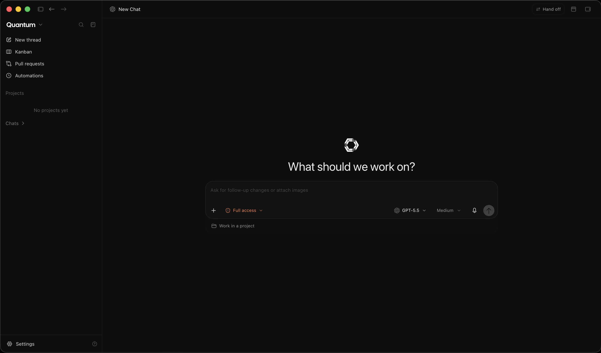

# Quantum

### AI Engineering and Autonomous Development Platform
**Author: Suryanshu Nabheet**

---

Quantum is an integrated software development platform architected for modern software engineering workflows. The monorepo houses a cohesive suite of developer tools spanning in-editor coding, autonomous agent orchestration, and terminal automation.

---

## Products Overview

The Quantum monorepo comprises three dedicated subsystems:

| Subsystem | Directory | Description | Technology Stack |
| :--- | :--- | :--- | :--- |
| **Quantum IDE** | [`ide/`](ide/) | AI-native editor with embedded workbench agent, inline code generation, and DOM inspection. | TypeScript, Electron, Monaco |
| **Quantum Agent Manager** | [`agent/`](agent/) | Desktop harness for parallel multi-agent execution, worktree isolation, and provider routing. | Electron, React, Effect, MCP |
| **Quantum CLI** | [`cli/`](cli/) | Terminal agent for automated multi-turn engineering tasks and script execution. | TypeScript, Bun |

---

### Quantum IDE

AI-native code editor featuring a first-party autonomous agent embedded directly into the workbench, inline code generation, DOM inspection, and an integrated browser for live page context attachment.

<p align="center">
  
</p>

- **Directory**: [`ide/`](ide/)
- **Description**: An AI-first development environment derived from VS Code with native workbench agent integration (`src/vs/workbench/contrib/agent`), integrated browser integration, and context-aware code synthesis.
- **Technology Stack**: TypeScript, Electron, Monaco Editor, Chromium

---

### Quantum Agent Manager

MCP-native desktop workspace and agent harness for orchestrating parallel AI coding sessions, multi-model workflows, and isolated git worktrees.

<p align="center">
  
</p>

- **Directory**: [`agent/`](agent/)
- **Description**: Desktop orchestration suite for managing concurrent agent tasks, multi-provider LLM routing, split chats, live terminals, browser previews, and cross-model handoffs in a single unified interface.
- **Technology Stack**: Electron, React, Effect-TS, Model Context Protocol (MCP)

---

### Quantum CLI

High-performance, terminal-first AI coding agent designed for autonomous software engineering, codebase exploration, and command-line automation.

<p align="center">
  
</p>

- **Directory**: [`cli/`](cli/)
- **Description**: Fast, keyboard-driven autonomous terminal agent with multi-provider model routing (Anthropic Claude, OpenAI, Gemini, Bedrock, Vertex, Ollama), built-in MCP client, and deep shell integration.
- **Technology Stack**: TypeScript, Bun, Node.js

---

## Monorepo Architecture

```
quantum/
├── agent/                 # Quantum Agent Manager
│   ├── apps/desktop/      # Native desktop window manager and runtime
│   ├── apps/server/       # Effect-based orchestration server
│   └── apps/web/          # Management interface and timeline renderer
│
├── ide/                   # Quantum IDE
│   ├── src/               # Editor core and workbench agent implementation
│   ├── extensions/        # Built-in developer extensions
│   └── build/             # Toolchain and packaging configurations
│
├── cli/                   # Quantum CLI
│   ├── bin/               # Executable entrypoint
│   └── src/               # Agent execution engine and provider drivers
│
├── scripts/               # Monorepo setup and verification (./scripts/setup.sh)
│
├── docs/                  # Central System Documentation
│   └── readme.md          # Architectural specifications
│
├── LICENCE                # MIT License
├── CONTRIBUTING.md        # Monorepo development guidelines
└── SECURITY.md            # Security and vulnerability disclosure policies
```

---

## Architectural Principles

- **Client-Side Data Isolation**: All code, configurations, session states, and credentials remain strictly on the host machine. No telemetry or non-consensual external network requests are executed.
- **Model Context Protocol (MCP) Compliance**: Standardized tool calling, resource resolution, and custom prompt execution across all interfaces.
- **Multi-Model Support**: Native integrations for Anthropic Claude, OpenAI GPT, Google Gemini, DeepSeek, xAI Grok, AWS Bedrock, Azure OpenAI, and local inference via Ollama.
- **Modular Packaging**: Subsystems maintain explicit boundaries, distinct build toolchains, and independent release cycles.

---

## Getting Started

One command sets up all three subsystems (CLI, Agent Manager, IDE):

```bash
./scripts/setup.sh
```

| Platform | Command |
|----------|---------|
| macOS / Linux | `./scripts/setup.sh` |
| Windows | `scripts\setup.bat` |

**Prerequisites:** [Bun](https://bun.sh) (>= 1.3.9), Node.js (>= 22; IDE pins 22.22.1 via `ide/.nvmrc`), Python 3.10–3.13 for IDE native modules.

```bash
# Verify after setup
./scripts/verify.sh
./scripts/e2e.sh

# Launch individual products
./cli/bin/quantum              # Terminal agent
cd agent && bun run dev        # Agent Manager
cd ide && ./scripts/code.sh    # IDE
```

See [scripts/README.md](scripts/README.md) for flags (`--skip-ide`, `--launch-ide`, per-subsystem setup) and troubleshooting.

---

## Documentation Links

- [Quantum IDE Specification](ide/README.md)
- [Quantum Agent Manager Specification](agent/README.md)
- [Quantum CLI Specification](cli/README.md)
- [Ecosystem Architecture Documentation](docs/readme.md)

---

## License

This software is distributed under the MIT License. See [LICENCE](LICENCE) for complete legal terms.
